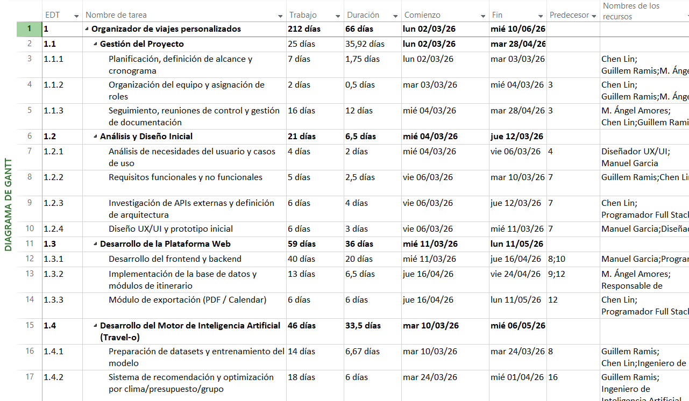
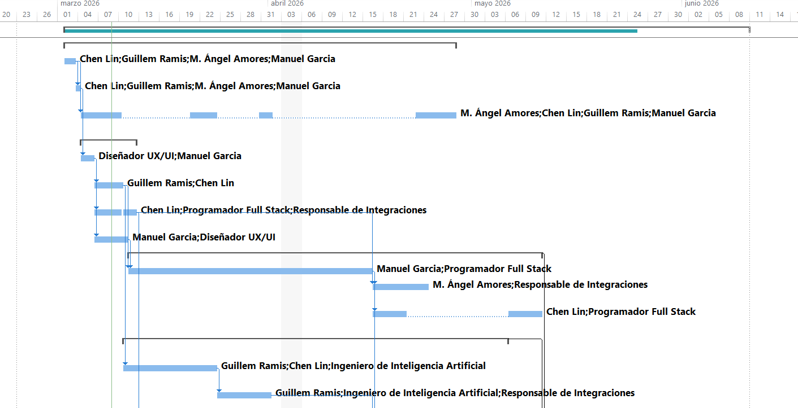
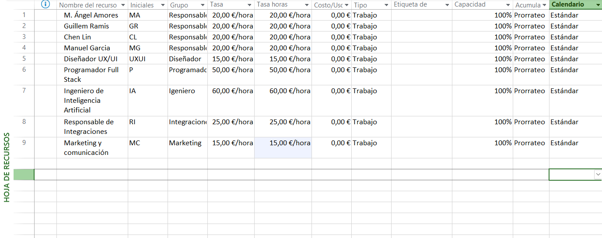

# 📅 Project Roadmap & Timeline: Travel-o

This document outlines the strategic scheduling, resource allocation, and critical path analysis for the Travel-o platform, covering a total duration of **66 working days** (124 calendar days).

---

## 🕒 Project Schedule Overview
* **Start Date:** March 2nd, 2026
* **End Date:** June 10th, 2026
* **Total Effort:** 212 days of work distributed across 4 team members and specialized technical roles.

---

## 📊 Visual Schedule (Gantt Chart)
The following chart represents the Work Breakdown Structure (WBS) and the chronological flow of project phases.

*Figure 1: Full project Gantt Chart showing dependencies and milestones.*

### Key Strategic Phases:
1. **Initiation & Planning (EDT 1.1 & 1.2):** Setting the business foundation and technical requirements.
2. **Core Development (EDT 1.3 & 1.4):** Concurrent development of the web platform and the AI engine.
3. **Integration & Validation (EDT 1.5 & 1.6):** Merging external data streams and rigorous system testing.

---

## ⚡ Critical Path Analysis
Understanding the critical path is essential for risk mitigation. Any delay in these tasks will directly impact the final launch date.

*Figure 2: Tasks in red identify the critical workstreams: AI training and API integration.*

**Identified Bottlenecks:**
* **Frontend/Backend Sync:** Core infrastructure must be stable before AI deployment.
* **API Normalization:** The quality of external data is vital for the AI's recommendation accuracy.

---

## 👥 Resource Management & Budgeting
The project was budgeted at **€48,000**, with resource rates carefully managed within Microsoft Project to ensure financial health.

*Figure 3: Detailed resource sheet with specialized rates and capacity allocation.*

* **Management & Coordination:** Chen Lin, Guillem Ramis, Manuel García, Miguel Ángel Amores.
* **Specialized Engineering:** Programador Full Stack (€50/h) and AI Engineer (€60/h).
